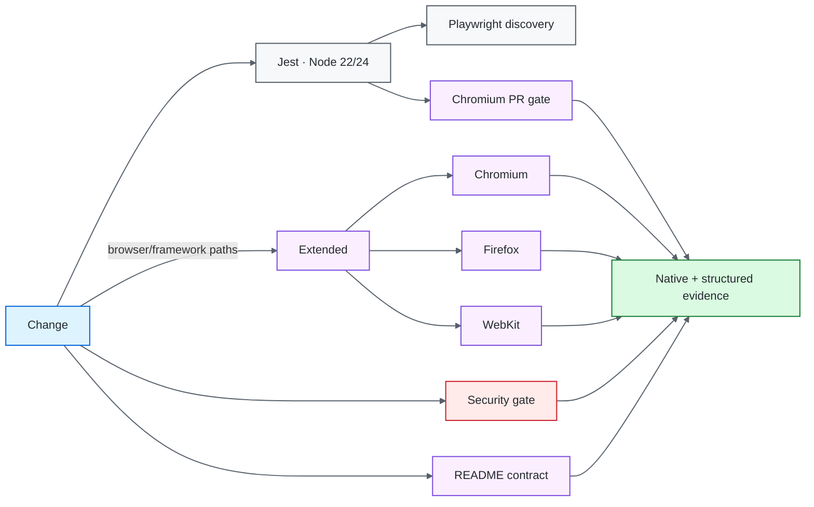
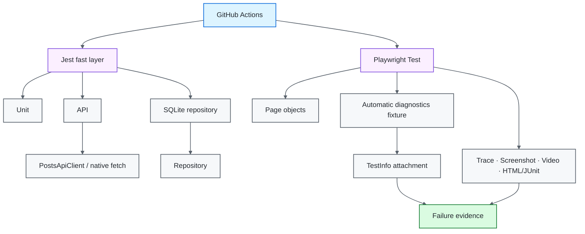
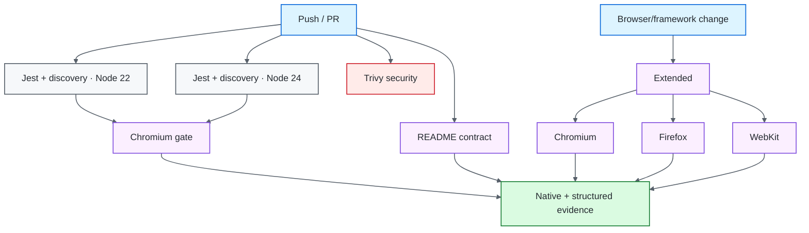

# Node.js / Playwright Quality Engineering Framework

[](https://github.com/portyu9/qa-automation-node-playwright/actions/workflows/ci.yml)
[](https://github.com/portyu9/qa-automation-node-playwright/actions/workflows/extended.yml)
[](https://github.com/portyu9/qa-automation-node-playwright/actions/workflows/security.yml)
[](https://github.com/portyu9/qa-automation-node-playwright/actions/workflows/docs.yml)

[](https://nodejs.org/)
[](https://developer.mozilla.org/docs/Web/JavaScript)
[](https://playwright.dev/)
[](https://jestjs.io/)
[](https://www.chromium.org/)
[](https://www.mozilla.org/firefox/)
[](https://webkit.org/)
[](https://github.com/features/actions)
[](https://trivy.dev/)
[](LICENSE)
[](.github/SECURITY.md)

A layered Node.js quality-engineering framework that combines Playwright browser automation with Jest unit/API/data verification and deterministic SQLite persistence checks. Browser policy stays in Playwright configuration, application behavior stays in feature-oriented pages, API transport stays behind a validated client boundary, test data is run-scoped, and failure diagnostics extend native Playwright evidence with a bounded privacy-aware automatic fixture.

> [!IMPORTANT]
> Native Playwright behavior is the primary abstraction. The framework adds policy only where it produces durable value: validated runtime configuration, test-data ownership, repository/transport boundaries, bounded diagnostics, evidence correlation, and risk-based browser coverage.

## Capability map

| Plane | What it proves | Execution | Evidence |
| --- | --- | --- | --- |
| Fast CI | Unit/API/data/framework behavior + discovery | Node 22 and 24 | Jest output + Playwright discovery |
| Primary browser | Critical browser behavior | Chromium / Node 22 | HTML, JUnit, trace, screenshot, video, diagnostic attachment |
| Extended browser | Engine compatibility | Chromium + Firefox + WebKit | Independent per-engine evidence |
| Security | Dependency/configuration exposure | Pinned Trivy filesystem scan | JSON findings + Markdown summary |
| Documentation contract | README links, workflow badges, Mermaid declarations, governance surfaces, badge palette | Python stdlib validator | Actions status |
| Observability | Run/gate identity | Structured envelope + native artifacts | `reports/ci-observability.json`, Actions summary |



## Engineering invariants

| Concern | Framework contract |
| --- | --- |
| Browser runner | Playwright Test remains authoritative for fixtures, locators, assertions, retries, tracing, and project selection. |
| Configuration | `config/env.js` validates browser/API HTTP targets, browser identity, timeouts, headless mode, and run ID before tests consume them. |
| API transport | `PostsApiClient` uses the validated API base URL, a dedicated abort timeout, run correlation, and injectable `fetch` for deterministic transport-policy tests. |
| Parallelism | Stateful values are unique/run-scoped; tests do not depend on order, worker identity, or mutable globals. |
| Persistence | SQLite repository operations have explicit lifecycle and deterministic Jest coverage. |
| Diagnostics | Automatic failure events are bounded by count/size and exclude bodies, auth headers, and cookies. |
| Browser coverage | Chromium is the fast gate; Firefox and WebKit are separate extended compatibility signals. |
| Reproducibility | Node 22/24 support, `package-lock.json`, `npm ci`, and lockfile-backed caching define the graph. |
| Evidence | Native Playwright artifacts remain primary; CI adds a small portable observability envelope. |
| Documentation | README-local references, workflow badges, Mermaid roots, governance files, and static badge-color uniqueness are executable contracts. |

## Tool ownership model

| Tool / technology | Native responsibility | Framework responsibility | Deliberately left visible |
| --- | --- | --- | --- |
| Playwright Test | Browser fixtures, contexts/pages, actionability, web-first assertions, retries, projects, traces and native reporters | Project policy, feature pages, run correlation, bounded diagnostic attachment, risk-based engine matrix | `Page`, locator/expect semantics, retry/project identity, native trace/screenshot/video behavior |
| Jest | Fast JavaScript test execution, mocks, assertions and test lifecycle | Unit/API/config/repository contract placement | Jest failure/stack and mock semantics are not wrapped as browser failures |
| Node `fetch` / `AbortSignal.timeout` | HTTP request execution and abort semantics | Validated API base URL, dedicated timeout, run header, response-shape/status policy, injectable fetch boundary | Native network/abort errors and HTTP status remain distinguishable |
| SQLite / repository layer | Database engine behavior and SQL semantics | Domain-oriented repository lifecycle and deterministic test state | Persistence is not hidden behind a generic data-access façade |
| Chromium / Firefox / WebKit | Browser-engine implementation differences | Primary-vs-extended execution policy and independent evidence | One-engine failures remain compatibility signals |
| Node/npm | Runtime/module execution and dependency resolution | Supported Node matrix, committed lockfile and `npm ci` policy | Lockfile/package-manager failures remain dependency/toolchain failures |
| Trivy | Filesystem vulnerability and supported misconfiguration analysis | HIGH/CRITICAL remediation-oriented gate and retained findings | The configured `vuln,misconfig` scan is not generic credential/secret scanning |
| GitHub Actions | Job/matrix scheduling and artifacts | Fast/browser/extended/security/docs separation and observability envelope | Native exit codes and job status remain authoritative |

## Architecture



## Repository map

```text
.
├── config/env.js
├── mock/
├── src/
│   ├── apiClient.js
│   ├── db.js
│   ├── pages/
│   ├── repositories/
│   └── testData/
├── tests/
│   ├── api/
│   ├── config/
│   ├── db/
│   ├── e2e/
│   └── fixtures/test.js
├── docs/
├── .github/
│   ├── scripts/
│   │   └── validate_readme.py
│   └── workflows/
│       ├── ci.yml
│       ├── docs.yml
│       ├── extended.yml
│       └── security.yml
├── jest.config.js
├── playwright.config.js
├── package.json
└── package-lock.json
```

## Documentation contract

`.github/workflows/docs.yml` validates deterministic repository-local documentation facts on every pull request and `main`: local Markdown targets, workflow badge targets, Mermaid declarations, canonical `LICENSE`/`.github/SECURITY.md`, unique static Shields colors, and the GitHub-dark `#24292F` Security Policy badge. It deliberately does not make external website uptime part of framework correctness.

## Quick start

Node.js 22+ is required.

```bash
npm ci
npx playwright install --with-deps chromium
npm run test:unit
npm run test:chromium
```

Run all configured engines locally:

```bash
npx playwright install --with-deps chromium firefox webkit
npm run test:e2e
```

Validate the README contract directly:

```bash
python .github/scripts/validate_readme.py
```

> [!NOTE]
> `npm ci` is the execution path. Use `npm install` only when intentionally changing dependencies, then review and commit the package manifest and lockfile together.

<details>
<summary><strong>Command reference</strong></summary>

| Command | Purpose |
| --- | --- |
| `npm run test:unit` | Jest unit/API/data/framework tests. |
| `npm run test:list` | Playwright discovery/config validation without execution. |
| `npm run test:chromium` | Fast browser gate. |
| `npm run test:e2e` | All configured Playwright projects. |
| `npm run test:smoke` | Tests matching the smoke convention. |
| `npm run test:headed` | Chromium headed diagnosis. |
| `npm run test:debug` | Playwright debug mode with one Chromium worker. |
| `npm run report` | Open the generated HTML report. |

</details>

## Runtime configuration

| Variable | Purpose | Default |
| --- | --- | --- |
| `TEST_BASE_URL` | Browser application target | `https://example.com` |
| `TEST_API_BASE_URL` | API helper target | JSONPlaceholder |
| `TEST_BROWSER` | Validated framework browser identity | `chromium` |
| `TEST_HEADLESS` | Browser headless mode | `true` |
| `TEST_ACTION_TIMEOUT_MS` | Action/assertion budget | `10000` |
| `TEST_NAVIGATION_TIMEOUT_MS` | Navigation budget | `20000` |
| `TEST_API_TIMEOUT_MS` | Native-fetch API request budget | `10000` |
| `TEST_RUN_ID` | Cross-layer correlation | generated UUID |

Only supported browser names and absolute safe HTTP(S) targets are accepted. Invalid runtime configuration is a deterministic framework error and should not be retried.

## Playwright execution policy

`playwright.config.js` centralizes runner behavior:

- fully parallel scheduling;
- `forbidOnly` in CI;
- bounded CI retries/workers;
- screenshot on failure;
- video retained on failure;
- trace on the first retry;
- deterministic HTML/JUnit locations;
- explicit Chromium, Firefox, and WebKit projects.

The framework intentionally does **not** add another browser runner façade. Playwright already implements actionability, auto-waiting, fixtures, project isolation, test metadata, and rich trace tooling.

## API transport boundary

`src/apiClient.js` does not hard-code a public service or own a second configuration model. `PostsApiClient` consumes the validated API target and timeout, adds `x-test-run-id`, uses Node's native `fetch`, rejects non-success HTTP status, validates the collection shape, and accepts an injected fetch implementation for transport-policy tests.

The Jest API suite exercises a loopback listener for real HTTP serialization without making the fast gate depend on public DNS/TLS/service uptime. Public-network integration remains an explicit environment choice rather than a unit-test prerequisite.

## Automatic runtime diagnostics

Browser specs import the extended fixture:

```js
const { test, expect } = require('../fixtures/test');
```

The automatic fixture records a bounded event buffer for:

- browser console warnings/errors;
- uncaught `pageerror` events;
- failed network requests;
- responses with HTTP status `>= 500`.

When actual status differs from expected status, it attaches `runtime-diagnostics` through native `TestInfo`. The payload records run ID, title path, project, retry index, duration, actual/expected status, and bounded events.

```text
Unexpected Playwright result
├── assertion + stack
├── trace
├── screenshot
├── retained video
└── runtime-diagnostics
    ├── console warning/error
    ├── pageerror
    ├── requestfailed
    └── 5xx response metadata
```

> [!WARNING]
> Generic diagnostics deliberately exclude request bodies, authorization values, cookies, and arbitrary response bodies. More logging is not automatically better evidence.

## Page-object and selector model

Page objects model feature operations and observable state, not renamed Playwright commands.

```js
const home = new HomePage(page);
await home.goto();
await expect(home.heading).toBeVisible();
```

Prefer `getByRole`, `getByLabel`, and stable test IDs. Avoid generated classes, DOM-depth selectors, and fixed delays.

```js
await page.waitForTimeout(3000); // elapsed time is not an application condition
```

## Test data and parallelism

`src/testData/factory.js` creates run-scoped unique values. Stateful tests should own creation and cleanup. When setup itself is not under test, use an API/repository boundary instead of performing unnecessary UI setup.

Parallel-safe tests require:

1. no mutable global business state;
2. unique mutable records/users where applicable;
3. no order/worker dependence;
4. explicit lifecycle ownership.

## Layer selection

| Requirement | Preferred layer |
| --- | --- |
| Pure business rule | Jest unit |
| HTTP status/transport/transform behavior | API test |
| Repository query/transaction | DB test |
| Browser rendering/navigation/accessibility | Playwright |
| Browser-engine compatibility | Extended Playwright matrix |
| Dependency/configuration exposure | Security workflow |

Choose the lowest layer that proves the requirement. Cross-browser matrices are for browser risk, not business-data multiplication.

## Cross-browser strategy

Primary CI executes Chromium after the Node 22/24 fast layer. `extended.yml` separately executes Chromium, Firefox, and WebKit on browser/framework changes, `main`, schedule, and manual dispatch.

Each engine cell:

- installs only the required browser and OS dependencies;
- gets an engine-specific `TEST_RUN_ID`;
- runs the native Playwright project;
- uploads independent HTML/JUnit/trace/screenshot/video/diagnostic evidence;
- writes an Actions Markdown summary.

A one-engine-only failure should be investigated as a compatibility signal before any shared assertion or timeout is weakened.

## Security engineering

`.github/workflows/security.yml` runs open-source Trivy filesystem analysis with an immutable action commit (`ed142fd0673e97e23eac54620cfb913e5ce36c25`, corresponding to `v0.36.0`) and Trivy engine `v0.74.0`.

The gate blocks on configured fixed HIGH/CRITICAL dependency vulnerabilities and HIGH/CRITICAL supported repository/configuration misconfigurations. `ignore-unfixed: true` keeps the blocking set remediation-oriented. Its configured scanners are `vuln,misconfig`; the repository does not present this gate as generic credential/secret scanning.

Evidence:

```text
reports/security/
├── trivy.json
└── summary.md
```

## Observability model

The framework uses **correlation + structured evidence**, with no required external analytics backend.

```text
GitHub Actions run
└── TEST_RUN_ID
    ├── Jest / Playwright job dimension
    ├── Playwright project + retry
    ├── native-fetch API correlation
    ├── runtime-diagnostics attachment
    ├── native artifacts
    └── reports/ci-observability.json
```

Primary browser CI writes a compact vendor-neutral JSON envelope containing framework identity, run ID, Node/browser dimensions, final job state, SHA, and ref. Actions also receives a human-readable Markdown summary.

This envelope is intentionally simple: it can later feed open-source collectors, log stores, or dashboards without embedding an observability vendor SDK in the tests.

## CI topology



## Failure triage

| Signal | First interpretation | Evidence |
| --- | --- | --- |
| Jest failure | Unit/API/repository/framework defect | Jest assertion/stack |
| `test:list` failure | Discovery/configuration drift | Playwright config output |
| README contract | Documentation/governance drift | Validator output |
| Native-fetch timeout/status failure | API transport/protocol | Jest error + injected/loopback boundary |
| Navigation failure | Target/network/application readiness | Trace + request failures |
| Locator/assertion failure | UI contract/application state | Trace + screenshot + DOM state |
| Console/page error | Browser runtime/application exception | `runtime-diagnostics` |
| Retry-only pass | Race/shared state/environment | First-attempt trace + diagnostics |
| Firefox/WebKit-only failure | Engine compatibility | Per-engine artifacts |
| Trivy failure | Dependency/configuration risk | `trivy.json` |

Do not broaden selectors, increase waits, or add retries until the failure boundary is understood.

## Extension rules

1. keep environment parsing in `config/env.js`;
2. keep API base/timeout/correlation policy in the API client boundary rather than tests;
3. preserve Playwright-native fixtures/locators/assertions/TestInfo;
4. add feature-oriented page/client/repository APIs, not generic wrappers;
5. extend diagnostics only with bounded privacy-safe metadata;
6. add fast Jest tests for non-browser infrastructure;
7. keep test data unique and lifecycle-owned;
8. keep lockfile changes deliberate;
9. add browser projects/matrices based on risk;
10. preserve structured evidence and run correlation;
11. keep security findings independent from behavioral retry/timeout policy;
12. update README contracts when a public command, workflow, tool responsibility, or evidence surface changes.

## Explicit anti-patterns

- fixed browser waits;
- DOM-depth/generated-class selectors when semantic contracts exist;
- browser setup duplicated in specs;
- public-network dependencies in the fast Jest API layer;
- hard-coded API URLs outside validated configuration;
- catch-and-ignore browser errors;
- unlimited diagnostic buffers;
- generic request/response dumps;
- shared mutable test users/records;
- retries defining correctness;
- `npm install` in CI;
- utility layers that simply rename Playwright methods;
- README claims or badge surfaces not backed by committed repository state.

## Design references

- [`docs/ARCHITECTURE.md`](docs/ARCHITECTURE.md) — browser, runner, API, data, and evidence boundaries.
- [`docs/TEST_STRATEGY.md`](docs/TEST_STRATEGY.md) — layer selection, engine coverage, reliability, and gate policy.

> [!TIP]
> Playwright already solves most browser mechanics well. Framework maturity comes from preserving those mechanics while making configuration, state ownership, evidence, and failure classification more deterministic.
