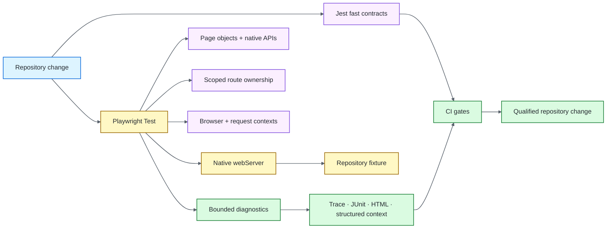

# Node.js / Playwright Quality Engineering Framework

[](https://github.com/portyu9/qa-automation-node-playwright/actions/workflows/ci.yml)
[](https://github.com/portyu9/qa-automation-node-playwright/actions/workflows/extended.yml)
[](https://github.com/portyu9/qa-automation-node-playwright/actions/workflows/security.yml)
[](https://github.com/portyu9/qa-automation-node-playwright/actions/workflows/docs.yml)

[](https://nodejs.org/)
[](https://developer.mozilla.org/docs/Web/JavaScript)
[](https://playwright.dev/)
[](https://jestjs.io/)
[](https://www.chromium.org/)
[](https://www.mozilla.org/firefox/)
[](https://webkit.org/)
[](https://github.com/features/actions)
[](https://trivy.dev/)
[](LICENSE)
[](.github/SECURITY.md)

A Node.js quality-engineering framework combining **Playwright Test** for browser behavior with **Jest** for fast configuration, API, persistence, and diagnostic contracts. Native Playwright primitives remain authoritative; custom code exists only where durable policy or application intent needs one owner.

> [!IMPORTANT]
> Required browser CI is deterministic by default. Playwright owns the repository-local application through native `webServer`; deployed browser/API targets are explicit integration choices rather than hidden prerequisites for framework health.

**Start here:** [capabilities](#capabilities) · [architecture](#architecture) · [quick start](#quick-start) · [repository map](#repository-map) · [documentation](#documentation)

## Capabilities

| Plane | Purpose | Primary evidence |
| --- | --- | --- |
| Fast CI | Configuration, API, persistence, diagnostics, browser discovery | Jest + coverage/discovery output |
| Primary browser | Critical UI/navigation behavior | Chromium + HTML/JUnit/trace/screenshot/video |
| Native browser primitives | Routing, request context, context state, file/download/popup lifecycle | Playwright assertions + native artifacts |
| Extended browser | Engine compatibility | Chromium + Firefox + WebKit |
| Security | SAST, advisory, dependency/configuration/secret, dependency-diff risk | CodeQL, npm Audit, Trivy, Dependency Review |
| Documentation | README/workflow/governance consistency | Documentation contract status |

## Architecture



Playwright owns **browser semantics and lifecycle**; Jest owns **fast deterministic contracts**; framework modules own only cross-cutting policy and application-specific abstractions. See [`docs/ARCHITECTURE.md`](docs/ARCHITECTURE.md) for the full ownership model.

## Quick start

```bash
npm ci
npx playwright install --with-deps chromium
npm run test:unit
npm run test:chromium
```

The default browser run starts `mock/server.js` automatically and waits for `/health`.

Run the full browser matrix:

```bash
npx playwright install --with-deps chromium firefox webkit
npm run test:e2e
```

Run an explicit deployed integration target:

```bash
TEST_BASE_URL=https://test.example.internal \
TEST_API_BASE_URL=https://api.test.example.internal \
npm run test:chromium
```

For the full runtime-variable table, local-server reuse policy, native capability details, evidence model, dependency maintenance, and failure triage, see [`docs/OPERATIONS.md`](docs/OPERATIONS.md).

## Repository map

```text
.
├── .github/
├── config/
├── docs/
├── mock/
├── src/
└── tests/
```

## Engineering contracts

- **Native Playwright ownership:** fixtures, projects, locators, actionability, assertions, routing, contexts, events, retries, traces, and reporters stay visible.
- **Deterministic target:** required browser CI uses the repository-owned fixture; public/deployed targets are separately classified integration runs.
- **Explicit reuse:** `TEST_REUSE_LOCAL_SERVER` is fail-closed by default so an unrelated local listener is not trusted accidentally.
- **Lowest sufficient layer:** API/configuration/persistence requirements remain below the browser when browser semantics are not material.
- **Owned state:** route handlers, contexts, child pages, downloads, persistence resources, and diagnostics are disposed by the scope that creates them.
- **Web-first synchronization:** locators, events, and assertions express readiness; fixed `waitForTimeout()` is not functional synchronization.
- **Privacy-aware evidence:** structured diagnostics are bounded/redacted; traces, screenshots, and video still require controlled synthetic data and retention.
- **Reliability visibility:** a retry-only pass is a defect signal, not proof the first failure was irrelevant.

## Quality gates

| Gate | Responsibility |
| --- | --- |
| [`ci.yml`](.github/workflows/ci.yml) | Lint/Jest coverage, evidence validation, Playwright discovery, supported runtime compatibility, required Chromium execution |
| [`extended.yml`](.github/workflows/extended.yml) | Chromium/Firefox/WebKit compatibility and additional supported-runtime browser contract |
| [`security.yml`](.github/workflows/security.yml) | Supply-chain policy, CodeQL, npm Audit, Trivy, Dependency Review when available |
| [`docs.yml`](.github/workflows/docs.yml) | Local links, badges, Mermaid, repository-map, governance/workflow contracts |

## Documentation

| Guide | Use it for |
| --- | --- |
| [`docs/ARCHITECTURE.md`](docs/ARCHITECTURE.md) | Configuration, `webServer`, browser fixtures, network ownership, diagnostics, isolation, extension rules |
| [`docs/TEST_STRATEGY.md`](docs/TEST_STRATEGY.md) | Layer selection, deterministic target policy, native browser capabilities, browser matrix, evidence, exit criteria |
| [`docs/OPERATIONS.md`](docs/OPERATIONS.md) | Commands, runtime inputs, execution policy, observability, CI topology, dependencies, triage |
| [`CONTRIBUTING.md`](CONTRIBUTING.md) | Change-quality expectations |

The deeper browser flow and operating detail lives in `/docs`; the main README intentionally keeps only the architecture overview above.

## Design principle

Use the **cheapest sufficient oracle** for each requirement. A strong Playwright framework makes the failed boundary obvious: **configuration, local target lifecycle, browser runtime, browser/context event semantics, application behavior, compatibility, API/data policy, evidence, or explicit deployed environment**.
