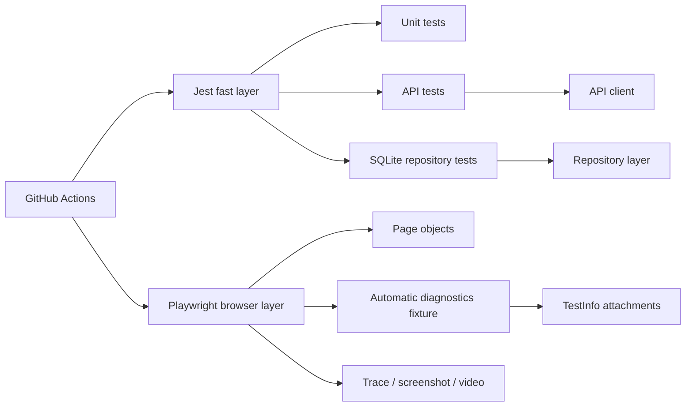
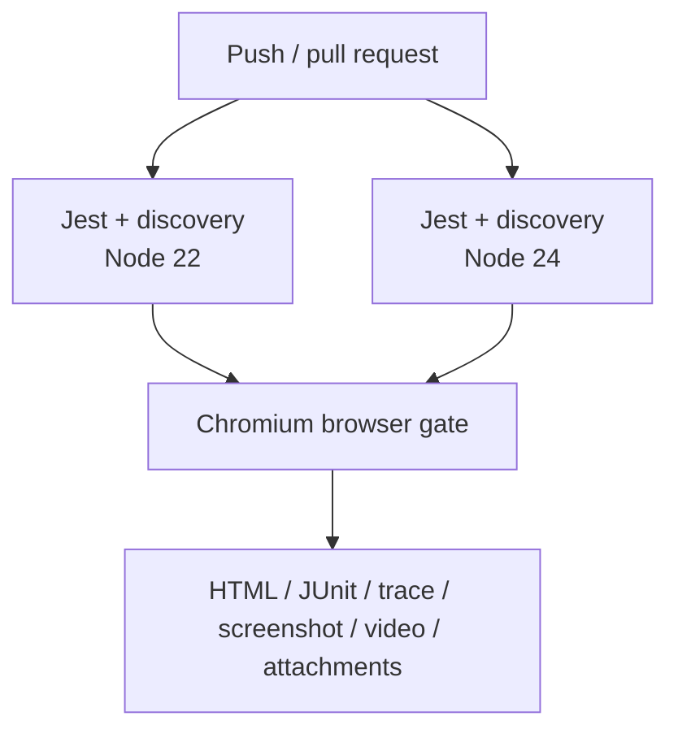

# Node.js / Playwright Automation Framework

A Node.js test framework that combines Playwright browser automation with Jest-based unit/API/data verification and SQLite-backed persistence checks. The design keeps browser policy in Playwright configuration, application intent in pages/repositories, deterministic data in factories, and failure diagnostics in native Playwright fixtures and artifacts.

## Engineering contract

| Concern | Framework policy |
| --- | --- |
| Browser API | Use Playwright directly; page objects model application intent rather than wrapping generic clicks/fills. |
| Configuration | Environment values are validated once in `config/env.js` and exposed as immutable runtime settings. |
| Test data | Stateful values are run-scoped and unique so parallel execution does not depend on ordering. |
| Persistence | SQLite repository operations have deterministic transaction boundaries and fast Jest coverage. |
| Diagnostics | Unexpected browser failures attach bounded runtime diagnostics in addition to traces/screenshots/video. |
| Retry policy | CI retries are bounded and diagnostic; a retry is not considered a reliability fix. |
| Cross-browser coverage | Chromium is the pull-request gate; Firefox and WebKit remain first-class configured projects. |
| Reproducibility | `package-lock.json`, `npm ci`, Node 22/24 validation, and lockfile-backed caching define the CI dependency graph. |

## Architecture



## Repository layout

```text
.
├── config/
│   └── env.js
├── mock/
├── src/
│   ├── apiClient.js
│   ├── db.js
│   ├── pages/
│   ├── repositories/
│   └── testData/
├── tests/
│   ├── api/
│   ├── config/
│   ├── db/
│   ├── e2e/
│   └── fixtures/
│       └── test.js
├── docs/
├── jest.config.js
├── playwright.config.js
├── package.json
└── package-lock.json
```

## Quick start

Node.js 22+ is required.

```bash
npm ci
npx playwright install --with-deps chromium
npm run test:unit
npm run test:chromium
```

`npm ci` is the normal installation command. Use `npm install` only when intentionally changing dependencies, review the resulting lockfile diff, and commit the manifest and lockfile together.

## Commands

| Command | Purpose |
| --- | --- |
| `npm run test:unit` | Run Jest unit/API/data/framework tests. |
| `npm run test:list` | List Playwright tests without executing them; catches discovery/config drift. |
| `npm run test:e2e` | Run every configured Playwright project. |
| `npm run test:chromium` | Run the fast Chromium browser gate. |
| `npm run test:smoke` | Run tests selected by the `@smoke` title/tag convention. |
| `npm run test:headed` | Run Chromium headed for local diagnosis. |
| `npm run test:debug` | Start Playwright debug mode with one Chromium worker. |
| `npm run report` | Open the generated Playwright HTML report. |

## Runtime configuration

| Variable | Purpose | Default |
| --- | --- | --- |
| `TEST_BASE_URL` | Browser application base URL | `https://example.com` |
| `TEST_API_BASE_URL` | API helper target | JSONPlaceholder |
| `TEST_BROWSER` | Validated browser selector | `chromium` |
| `TEST_HEADLESS` | Browser headless mode | `true` |
| `TEST_ACTION_TIMEOUT_MS` | Action/assertion budget | `10000` |
| `TEST_NAVIGATION_TIMEOUT_MS` | Navigation budget | `20000` |
| `TEST_RUN_ID` | Cross-layer diagnostic/data correlation | generated UUID |

Only absolute HTTP(S) URLs and supported browser names are accepted. Configuration failures should be fixed at the source; they are not retry candidates.

## Playwright execution policy

`playwright.config.js` centralizes runner behavior:

- `fullyParallel` enables parallel test scheduling;
- `forbidOnly` blocks committed focused tests in CI;
- CI retries and worker count are bounded;
- screenshots are captured on failure;
- video is retained on failure;
- trace is recorded on the first retry;
- JUnit and HTML reports are written to deterministic locations;
- Chromium, Firefox, and WebKit are explicit projects.

The framework does not introduce a second browser runner abstraction. Playwright already supplies robust fixtures, auto-waiting, locators, assertions, tracing, and test metadata.

## Automatic browser diagnostics

Browser tests import from `tests/fixtures/test.js` instead of directly from `@playwright/test`:

```js
const { test, expect } = require('../fixtures/test');
```

That module extends Playwright with an **automatic fixture**. During each browser test it records a bounded event buffer for:

- browser console warnings and errors;
- uncaught page errors;
- failed network requests;
- HTTP responses with status 500 or higher.

When the actual status differs from the expected status, the fixture attaches `runtime-diagnostics` JSON through Playwright `TestInfo`. The attachment includes the run ID, title path, project, retry index, duration, status, and the captured events. Event count and message length are bounded to prevent a runaway page from generating an unmanageable artifact.

This is complementary evidence:

```text
Playwright failure
├── assertion / stack trace
├── trace (first retry)
├── screenshot (failure)
├── video (retained on failure)
└── runtime-diagnostics attachment
    ├── console warning/error
    ├── pageerror
    ├── requestfailed
    └── 5xx response metadata
```

The diagnostic fixture intentionally does not capture request bodies, authorization headers, cookies, or arbitrary response bodies.

## Page-object design

Page objects should expose **application operations and observable state**. Prefer semantic locators such as `getByRole`, `getByLabel`, and stable test IDs.

Good:

```js
const home = new HomePage(page);
await home.goto();
await expect(home.heading).toBeVisible();
```

Avoid:

```js
await page.waitForTimeout(3000);
await helper.click('.generated-class:nth-child(4)');
```

Playwright's web-first assertions and actionability checks already implement synchronization. A fixed sleep adds latency without proving readiness.

## Test data and parallelism

`src/testData/factory.js` generates run-scoped unique values. Stateful tests should own creation and cleanup. When setup is not the behavior being tested, establish state through API or persistence helpers instead of driving unnecessary UI steps.

Parallel-safe tests follow three rules:

1. no mutable global business state;
2. unique data identifiers;
3. no dependency on test order or worker identity.

## API and persistence layers

The API client and repository modules allow cross-layer verification without turning browser tests into end-to-end monoliths. Repository tests use the maintained SQLite driver with deterministic transaction behavior.

Choose the lowest layer capable of proving the requirement:

| Requirement | Preferred layer |
| --- | --- |
| Pure business calculation | Jest unit |
| HTTP transformation/status semantics | API test |
| Repository query/transaction behavior | DB test |
| Browser rendering/navigation/accessibility contract | Playwright |
| Browser-engine-specific behavior | Targeted Playwright project matrix |

## Cross-browser strategy

Chromium is the default pull-request gate for feedback speed. Run broader coverage when risk justifies it:

```bash
npx playwright test --project=firefox
npx playwright test --project=webkit
```

Cross-browser multiplication should focus on critical journeys, browser-specific APIs, layout/input differences, and release risk. Business-data permutations belong in faster layers.

## CI topology



CI installs from the committed lockfile with `npm ci`, uses lockfile-backed npm caching, and validates Node 22 and 24 in the fast layer before running the browser gate.

## Failure triage

Use the evidence in this order:

1. **Jest failure** — isolate the unit/API/repository behavior before involving a browser.
2. **Playwright discovery/config failure** — inspect `test:list` and runtime validation.
3. **Navigation failure** — inspect response status, request failures, and trace.
4. **Locator/assertion failure** — inspect trace, screenshot, DOM state, and page errors.
5. **Intermittent retry pass** — compare first-attempt trace and diagnostic events; investigate race/shared state/environment load.
6. **Only one browser fails** — classify browser-specific behavior before weakening a shared assertion.

Do not make selectors broader or add timeouts until the failure class is understood.

## Extension rules

When adding capability:

- keep environment parsing in `config/env.js`;
- add application-specific page/repository/client methods instead of generic wrappers;
- extend the automatic fixture only with bounded, privacy-safe evidence;
- add fast Jest tests for infrastructure that does not require a browser;
- preserve Playwright-native fixtures, locators, assertions, and `TestInfo` artifacts;
- keep lockfile updates deliberate and CI-validated;
- add browser projects based on risk, not as a substitute for lower-layer coverage.

## Anti-patterns

The framework intentionally avoids:

- fixed waits;
- CSS-class/DOM-depth selectors when semantic contracts exist;
- browser setup duplicated inside individual specs;
- catch-and-ignore browser errors;
- unlimited diagnostic buffers;
- full request/response dumps in generic failure hooks;
- global shared test users or records;
- test retries used to define correctness;
- `npm install` in CI with an unpinned dependency graph;
- utility layers that simply rename Playwright methods.

## Further design documentation

- [`docs/ARCHITECTURE.md`](docs/ARCHITECTURE.md) — runner, API, data, and browser boundaries.
- [`docs/TEST_STRATEGY.md`](docs/TEST_STRATEGY.md) — layer selection, browser coverage, and reliability policy.

The framework should optimize for **fast attribution of failures**. Native Playwright evidence plus bounded runtime diagnostics makes an unexpected browser result easier to classify without turning every test into a logging script.
