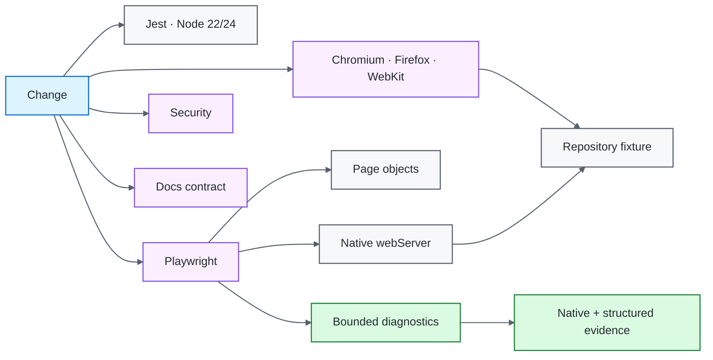

# Node.js / Playwright Quality Engineering Framework

[](https://github.com/portyu9/qa-automation-node-playwright/actions/workflows/ci.yml)
[](https://github.com/portyu9/qa-automation-node-playwright/actions/workflows/extended.yml)
[](https://github.com/portyu9/qa-automation-node-playwright/actions/workflows/security.yml)
[](https://github.com/portyu9/qa-automation-node-playwright/actions/workflows/docs.yml)

[](https://nodejs.org/)
[](https://developer.mozilla.org/docs/Web/JavaScript)
[](https://playwright.dev/)
[](https://jestjs.io/)
[](https://www.chromium.org/)
[](https://www.mozilla.org/firefox/)
[](https://webkit.org/)
[](https://github.com/features/actions)
[](https://trivy.dev/)
[](LICENSE)
[](.github/SECURITY.md)

A layered Node.js quality-engineering framework that combines Playwright browser automation with Jest unit/API/data verification, deterministic SQLite persistence checks, repository-owned application fixtures, bounded privacy-aware diagnostics, and reproducible CI.

> [!IMPORTANT]
> Required browser CI is deterministic by default. Playwright starts the repository-owned loopback fixture through its native `webServer` lifecycle. A real deployed browser/API target remains an explicit configuration choice rather than a dependency of framework correctness.

## Capability map

| Plane | What it proves | Execution | Evidence |
| --- | --- | --- | --- |
| Fast CI | Unit/API/data/framework contracts + browser discovery | Node 22 and 24 | Jest + discovery output |
| Primary browser | Navigation, semantic UI, page-object behavior | Chromium / local fixture | HTML, JUnit, trace, screenshot, video, diagnostics |
| Extended browser | Engine compatibility | Chromium + Firefox + WebKit / local fixture | Per-engine evidence |
| API transport | HTTP serialization and client policy | Loopback server + injectable fetch | Jest assertions |
| Persistence | Repository/data lifecycle | SQLite | Jest assertions |
| Security | Dependency/configuration exposure | Trivy filesystem scan | JSON + Markdown findings |
| Documentation | README/workflow/governance consistency | Repository-local validator | Actions status |
| Observability | Run/gate identity | Structured CI envelope | `reports/` + Actions summary |



## Engineering invariants

| Concern | Framework contract |
| --- | --- |
| Default target | Browser/API defaults are `http://127.0.0.1:3001`. |
| Fixture lifecycle | Playwright native `webServer` starts the local fixture only for the default browser target. |
| External integration | Explicit non-default URLs select deployed targets without redefining required CI health. |
| Browser runner | Playwright Test remains authoritative for fixtures, locators, assertions, retries, projects, traces, and reporters. |
| Configuration | `config/env.js` validates browser/API URLs, browser identity, timeouts, headless mode, and run ID. |
| API transport | `PostsApiClient` owns timeout/correlation/status/shape policy and supports injectable `fetch`. |
| Persistence | SQLite repository operations have explicit lifecycle and deterministic Jest coverage. |
| Parallelism | Test/run state is isolated; no test depends on order or mutable globals. |
| Diagnostics | Automatic runtime events are bounded and sanitize URL/text data before attachment. |
| Browser coverage | Chromium is primary; Firefox/WebKit are separate compatibility signals. |
| Reproducibility | Node 22/24, committed lockfile, `npm ci`, and browser installation define the toolchain. |
| CI safety | Least-privilege permissions, concurrency cancellation, and bounded jobs are required. |

## Tool ownership model

| Tool / technology | Native responsibility | Framework responsibility |
| --- | --- | --- |
| Playwright Test | Browser fixtures, projects, web server lifecycle, actionability, assertions, retries, traces/reporters | Project policy, local target selection, page models, evidence correlation |
| Jest | Fast JavaScript tests, mocks, assertions | Config/API/persistence/diagnostic contract placement |
| Node HTTP | HTTP listener/serialization | Minimal local browser/API fixture |
| Node `fetch` / `AbortSignal.timeout` | Request execution and abort semantics | API client timeout/correlation/status/shape boundary |
| SQLite | Database engine and SQL semantics | Repository lifecycle and deterministic state ownership |
| Chromium / Firefox / WebKit | Browser behavior | Primary-vs-extended matrix policy |
| GitHub Actions | Scheduling and artifacts | Gate separation, bounded execution, run correlation |
| Trivy | Supported vulnerability/misconfiguration analysis | HIGH/CRITICAL remediation gate |

## Repository map

```text
.
├── config/env.js
├── mock/
│   ├── data.json
│   └── server.js
├── src/
│   ├── apiClient.js
│   ├── db.js
│   ├── diagnostics/
│   ├── pages/
│   ├── repositories/
│   └── testData/
├── tests/
│   ├── api/
│   ├── config/
│   ├── db/
│   ├── diagnostics/
│   ├── e2e/
│   └── fixtures/test.js
├── docs/
│   ├── ARCHITECTURE.md
│   └── TEST_STRATEGY.md
├── .github/
│   ├── CODEOWNERS
│   ├── SECURITY.md
│   ├── pull_request_template.md
│   ├── scripts/validate_readme.py
│   └── workflows/
├── CONTRIBUTING.md
├── jest.config.js
├── playwright.config.js
├── package.json
└── package-lock.json
```

## Quick start

Node.js 22+ is required.

```bash
npm ci
npx playwright install --with-deps chromium
npm run test:unit
npm run test:chromium
```

The default browser run starts `mock/server.js` automatically and waits for `/health` before tests execute.

Run all configured engines:

```bash
npx playwright install --with-deps chromium firefox webkit
npm run test:e2e
```

Run against an explicitly selected deployed application:

```bash
TEST_BASE_URL=https://test.example.internal \
TEST_API_BASE_URL=https://api.test.example.internal \
npm run test:chromium
```

Public-service availability should not determine whether the required framework gate is green.

## Runtime configuration

| Variable | Purpose | Default |
| --- | --- | --- |
| `TEST_BASE_URL` | Browser application target | `http://127.0.0.1:3001` |
| `TEST_API_BASE_URL` | API helper target | `http://127.0.0.1:3001` |
| `TEST_BROWSER` | `chromium`, `firefox`, or `webkit` | `chromium` |
| `TEST_HEADLESS` | Browser headless mode | `true` |
| `TEST_ACTION_TIMEOUT_MS` | Action/assertion budget | `10000` |
| `TEST_NAVIGATION_TIMEOUT_MS` | Navigation budget | `20000` |
| `TEST_API_TIMEOUT_MS` | Native-fetch request budget | `10000` |
| `TEST_RUN_ID` | Cross-layer correlation | generated UUID |

Browser/API URLs must be safe absolute HTTP(S) targets without credentials, query strings, or fragments. Invalid configuration is a deterministic framework error and should fail before useful browser/network work begins.

## Deterministic local application fixture

`mock/server.js` owns both browser and API fixtures using Node's built-in HTTP server:

- `/health` — readiness;
- `/` — semantic landing page with stable test IDs;
- `/details` — navigation destination;
- `/posts` — deterministic API collection.

The fixture has no public DNS, TLS, third-party assets, accounts, or upstream service dependency.

`playwright.config.js` conditionally enables `webServer` when `TEST_BASE_URL` equals the default fixture URL. Playwright starts the process, waits for `/health`, runs the browser suite, and owns shutdown. When a non-default application URL is configured, no local browser server is started.

The Jest API suite can also bind the same exported server on an ephemeral loopback port, proving HTTP serialization without depending on the fixed browser-fixture port.

## Browser contract

The browser layer proves deterministic user-visible behavior:

1. navigation returns a successful document;
2. the landing page exposes `Quality Engineering Fixture` through stable semantic/test-ID contracts;
3. the page object exposes application intent rather than generic Playwright wrappers;
4. the primary link navigates to `/details`;
5. the destination exposes `Fixture Details`.

The old Example Domain/IANA dependency is intentionally absent from required browser execution.

## Playwright execution policy

`playwright.config.js` centralizes:

- fully parallel scheduling;
- `forbidOnly` in CI;
- bounded CI retries/workers;
- screenshot on failure;
- retained failure video;
- trace on first retry;
- deterministic HTML/JUnit output;
- Chromium, Firefox, and WebKit projects;
- conditional native `webServer` lifecycle.

The framework does not wrap `page`, `locator`, or `expect` with another browser API.

## Page-object and selector model

Page objects model feature operations and owned locators. Prefer accessibility semantics and stable test IDs over generated CSS classes or DOM depth.

```js
const home = new HomePage(page);
await home.goto();
await expect(home.heading).toHaveText('Quality Engineering Fixture');
```

Use Playwright auto-waiting and web-first assertions. Fixed `waitForTimeout()` synchronization is prohibited for functional readiness.

## API transport boundary

`PostsApiClient` consumes validated configuration, applies an abort timeout and run correlation, rejects unsuccessful HTTP status, validates response shape, and supports an injected `fetch` for deterministic policy tests.

Keep external integration explicit. Fast API tests use loopback or injected transport so public-network variability is not confused with client-policy defects.

## Automatic runtime diagnostics

Browser specs use the automatic fixture in `tests/fixtures/test.js`. It records a bounded buffer for console warnings/errors, page errors, failed requests, and HTTP 5xx responses. Diagnostic URLs/text are sanitized before retained state is written.

On an unexpected result, the attachment includes safe run/test/project/retry/status metadata plus bounded events. Native trace, screenshot, video, HTML, and JUnit remain the authoritative browser reconstruction evidence.

Generic diagnostics deliberately exclude request bodies, auth headers, cookies, and arbitrary response bodies. Screenshots/traces/video still require safe synthetic test data.

## Test data, persistence, and parallelism

Stateful values should be unique per test/run. SQLite repository tests own their lifecycle; browser contexts are isolated by Playwright. No test may depend on execution order or worker identity.

When setup itself is not the behavior under test, prefer an API/repository boundary rather than unnecessary UI setup.

## Cross-browser strategy

Primary CI runs Chromium. `extended.yml` independently runs Chromium, Firefox, and WebKit against the same repository fixture on relevant changes, `main`, schedule, and manual dispatch.

Cross-browser matrices prove compatibility risk; they should not multiply unrelated business-data cases.

## Evidence and observability

CI retains Playwright HTML/JUnit, trace/screenshot/video evidence, bounded runtime diagnostics, and a compact observability envelope containing run ID, browser/runtime dimension, commit/ref, target class, and final job status.

A retry-only pass is a reliability signal and should be investigated rather than normalized by increasing retries.

## Failure classification

| Signal | First interpretation |
| --- | --- |
| Jest/config | Deterministic framework logic |
| Local fixture startup | Repository target lifecycle/port ownership |
| Browser startup | Playwright/browser/runtime infrastructure |
| Navigation/status | Application route/HTTP boundary |
| Selector/assertion | Browser-visible contract |
| Runtime 5xx/requestfailed | Dependency/network context |
| Browser-engine-only failure | Compatibility |
| Retry-only pass | Reliability/flakiness |
| External-target-only failure | Environment/integration first |
| Security/docs | Independent repository gate |

## Security and documentation governance

`.github/workflows/security.yml` runs Trivy filesystem analysis and preserves supported dependency/misconfiguration findings. `.github/workflows/docs.yml` validates repository-local links, workflow badges, Mermaid declarations, governance surfaces, and badge constraints.

Change expectations live in [`CONTRIBUTING.md`](CONTRIBUTING.md), with explicit ownership in [`.github/CODEOWNERS`](.github/CODEOWNERS).

## Extension rules

When extending the framework:

1. use the lowest layer that proves the requirement;
2. keep required CI deterministic and repository-owned;
3. use Playwright native lifecycle/actions/assertions where they already express the contract;
4. keep external application/API targets explicit;
5. validate configuration before side effects;
6. avoid fixed waits and hidden retries;
7. keep test/run state isolated;
8. sanitize/bound retained diagnostics before persistence;
9. add compatibility dimensions only when browser risk justifies them.

## Explicit anti-patterns

- required browser CI against a public demonstration website;
- generic wrappers around native Playwright primitives;
- fixed `waitForTimeout()` readiness;
- blanket retries around mutating actions;
- shared mutable worker/test state;
- public-network calls in deterministic unit/API contracts;
- credentials, request bodies, or raw tokens in generic evidence;
- browser-matrix expansion without compatibility risk.

## Design references

- [`docs/ARCHITECTURE.md`](docs/ARCHITECTURE.md) — configuration, local fixture, runner, page, data, and evidence boundaries.
- [`docs/TEST_STRATEGY.md`](docs/TEST_STRATEGY.md) — layer selection, deterministic target policy, browser matrix, evidence, and exit criteria.

A strong Playwright framework makes the failed boundary obvious: configuration, local target lifecycle, browser runtime, application behavior, compatibility, data/API policy, evidence, or explicit deployed environment.