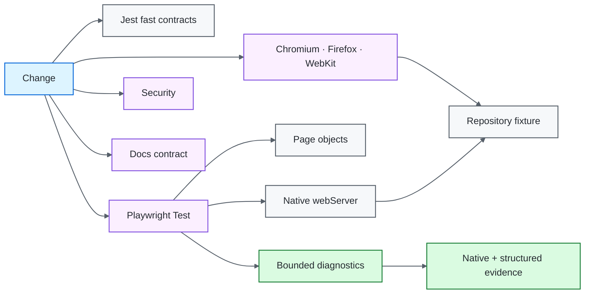

# Node.js / Playwright Quality Engineering Framework

[](https://github.com/portyu9/qa-automation-node-playwright/actions/workflows/ci.yml)
[](https://github.com/portyu9/qa-automation-node-playwright/actions/workflows/extended.yml)
[](https://github.com/portyu9/qa-automation-node-playwright/actions/workflows/security.yml)
[](https://github.com/portyu9/qa-automation-node-playwright/actions/workflows/docs.yml)

[](https://nodejs.org/)
[](https://developer.mozilla.org/docs/Web/JavaScript)
[](https://playwright.dev/)
[](https://jestjs.io/)
[](https://www.chromium.org/)
[](https://www.mozilla.org/firefox/)
[](https://webkit.org/)
[](https://github.com/features/actions)
[](https://trivy.dev/)
[](LICENSE)
[](.github/SECURITY.md)

A Node.js quality-engineering framework that combines **Playwright Test** for browser behavior with **Jest** for fast configuration/API/persistence contracts. The framework deliberately uses Playwright's native runner, fixtures, actionability, web-first assertions, projects, retries, traces, and reporters instead of building a second browser abstraction layer.

> [!IMPORTANT]
> Required browser CI is deterministic by default. Playwright owns the repository-local application through its native `webServer` lifecycle. Deployed browser/API targets are explicit integration choices, not hidden prerequisites for framework correctness.

**Read by intent:** [capabilities](#capability-map) · [architecture](#architecture) · [quick start](#quick-start) · [browser strategy](#playwright-execution-policy) · [evidence](#evidence-and-observability) · [dependencies](#dependency-maintenance) · [triage](#failure-triage)

## Capability map

| Plane | What it proves | Execution | Evidence |
| --- | --- | --- | --- |
| Fast CI | Configuration, API, persistence, diagnostics + browser discovery | Node 22 / 24 | Jest + discovery output |
| Primary browser | Critical UI/navigation behavior | Chromium + local fixture | HTML, JUnit, trace, screenshot, video |
| Extended browser | Engine compatibility | Chromium + Firefox + WebKit | Per-engine evidence |
| API transport | Serialization, timeout, correlation, response policy | Loopback or injected `fetch` | Jest assertions |
| Persistence | Repository/data lifecycle | SQLite | Jest assertions |
| Security | Dependency/configuration exposure | Trivy filesystem scan | JSON + Markdown findings |
| Documentation | README/workflow/governance consistency | Repository-local validator | Actions status |

## Architecture



## Engineering invariants

| Concern | Framework contract |
| --- | --- |
| Default target | Browser/API defaults are `http://127.0.0.1:3001`. |
| Fixture lifecycle | Native `webServer` owns startup/readiness/shutdown for the default browser target. |
| External integration | Explicit non-default URLs select deployed targets without redefining required CI health. |
| Runner ownership | Playwright Test remains authoritative for browser fixtures, projects, assertions, retries, traces, and reporters. |
| Configuration | `config/env.js` validates URL, browser, timeout, headless, and run-ID policy before execution. |
| API transport | `PostsApiClient` owns timeout/correlation/status/shape policy and supports injectable `fetch`. |
| Isolation | Browser contexts/test data do not depend on order, worker identity, or mutable globals. |
| Synchronization | Locators and web-first assertions express readiness; fixed `waitForTimeout()` is not functional synchronization. |
| Diagnostics | Automatic runtime evidence is bounded and sanitizes URL/text data before attachment. |
| Compatibility | Chromium is primary; Firefox/WebKit are separate compatibility signals. |
| Reproducibility | Node 22/24, lockfile, `npm ci`, and pinned browser installation define the toolchain. |

## Boundary decision guide

| Requirement | Preferred surface | Reason |
| --- | --- | --- |
| Pure JavaScript/configuration rule | Jest | Lowest dependency surface |
| API client timeout/status/shape policy | Jest + injected `fetch` | Deterministic transport contract |
| HTTP serialization | Loopback fixture | Real protocol without public-network noise |
| Database repository semantics | Jest + SQLite | Persistence is the subject |
| Navigation/rendering/input/actionability | Playwright | Requires browser semantics |
| Cross-engine behavior | Extended projects | Compatibility is independently attributable |
| Deployed-environment behavior | Explicit target run | Environment availability is intentionally separate |

> [!TIP]
> Use browser automation when browser behavior is material. Do not move API/data setup into the UI simply to make a test “end to end.”

## Repository map

```text
.
├── config/env.js
├── mock/{data.json,server.js}
├── src/
│   ├── apiClient.js
│   ├── db.js
│   ├── diagnostics/
│   ├── pages/
│   ├── repositories/
│   └── testData/
├── tests/{api,config,db,diagnostics,e2e}/
├── tests/fixtures/test.js
├── docs/{ARCHITECTURE.md,TEST_STRATEGY.md}
├── .github/workflows/{ci,docs,extended,security}.yml
├── CONTRIBUTING.md
├── jest.config.js
├── playwright.config.js
├── package.json
└── package-lock.json
```

## Quick start

Node.js 22+ is required.

```bash
npm ci
npx playwright install --with-deps chromium
npm run test:unit
npm run test:chromium
```

The default browser run starts `mock/server.js` automatically and waits for `/health`.

```bash
# all configured engines
npx playwright install --with-deps chromium firefox webkit
npm run test:e2e

# explicit deployed target
TEST_BASE_URL=https://test.example.internal \
TEST_API_BASE_URL=https://api.test.example.internal \
npm run test:chromium
```

<details>
<summary><strong>Execution model</strong></summary>

- **Jest** proves fast framework/API/data contracts.
- **Chromium** is the required browser gate.
- **Firefox/WebKit** extend compatibility coverage without multiplying unrelated data cases.
- **External targets** are explicit integration runs and never substitute for the local deterministic gate.

</details>

## Runtime configuration

| Variable | Purpose | Default |
| --- | --- | --- |
| `TEST_BASE_URL` | Browser application target | `http://127.0.0.1:3001` |
| `TEST_API_BASE_URL` | API helper target | `http://127.0.0.1:3001` |
| `TEST_BROWSER` | `chromium`, `firefox`, or `webkit` | `chromium` |
| `TEST_HEADLESS` | Browser headless mode | `true` |
| `TEST_ACTION_TIMEOUT_MS` | Action/assertion budget | `10000` |
| `TEST_NAVIGATION_TIMEOUT_MS` | Navigation budget | `20000` |
| `TEST_API_TIMEOUT_MS` | Native-fetch request budget | `10000` |
| `TEST_RUN_ID` | Cross-layer correlation | generated UUID |

URLs must be safe absolute HTTP(S) targets without credentials, query strings, or fragments.

## Deterministic local application fixture

`mock/server.js` owns `/health`, `/`, `/details`, and `/posts` using Node's built-in HTTP server. It has no public DNS, external assets, accounts, or upstream dependencies.

`playwright.config.js` enables `webServer` only when the browser target is the committed local default. For non-default targets, the framework does not secretly start a local app. Jest API tests can bind the same exported server on an ephemeral loopback port to prove HTTP serialization independently of the fixed browser port.

## Playwright execution policy

`playwright.config.js` centralizes fully parallel scheduling, `forbidOnly` in CI, bounded retries/workers, screenshot-on-failure, retained failure video, trace-on-first-retry, deterministic HTML/JUnit output, browser projects, and native web-server lifecycle.

Page objects model application operations and owned locators; they do not rename `page`, `locator`, or `expect`.

```js
const home = new HomePage(page);
await home.goto();
await expect(home.heading).toHaveText('Quality Engineering Fixture');
```

Prefer accessibility semantics and stable test IDs. Use Playwright actionability and web-first assertions instead of fixed elapsed-time waits.

## API, data, and parallelism

`PostsApiClient` applies validated target configuration, abort timeout, run correlation, successful-status enforcement, response-shape validation, and injectable transport. Stateful values should be unique per test/run. SQLite repository tests own their lifecycle; browser contexts remain isolated by Playwright.

## Evidence and observability

The automatic fixture in `tests/fixtures/test.js` keeps a bounded buffer of console warnings/errors, page errors, failed requests, and HTTP 5xx events. URLs/text are sanitized before retained evidence is written.

Native Playwright artifacts remain authoritative: trace, screenshot, video, HTML, and JUnit. Generic diagnostics intentionally exclude request bodies, auth headers, cookies, and arbitrary response bodies.

> [!WARNING]
> Trace/video/screenshots can still contain application-visible data. Use synthetic data and retention policy; structured URL sanitization does not sanitize pixels.

## CI topology

- `ci.yml` — Node compatibility, Jest contracts, primary Chromium.
- `extended.yml` — Chromium/Firefox/WebKit compatibility.
- `security.yml` — independent Trivy repository gate.
- `docs.yml` — local-link/badge/Mermaid/governance contract.

A retry-only pass is a reliability signal. The response is investigation, not automatic retry expansion.

## Dependency maintenance

Dependabot maintains **npm** and **GitHub Actions** dependencies.

- weekly Monday 09:00 America/New_York schedule;
- minor/patch updates grouped to reduce PR noise;
- major upgrades remain standalone for attributable review;
- Actions are treated as executable supply-chain dependencies, not static YAML decoration;
- automated PRs must still clear unit/browser/security/docs gates and be reviewed for release-note, browser, Node, and transitive-impact changes.

Dependabot complements lockfile reproducibility and Trivy; none of those controls replaces the others.

## Failure triage

| Signal | First interpretation |
| --- | --- |
| Jest/config | Deterministic framework logic |
| Local fixture startup | Repository target lifecycle/port ownership |
| Browser startup | Playwright/browser/runtime infrastructure |
| Navigation/status | Application route/HTTP boundary |
| Locator/assertion | Browser-visible contract/readiness |
| `requestfailed` / 5xx | Network/dependency context |
| Browser-engine-only failure | Compatibility |
| Retry-only pass | Reliability/flakiness |
| External-target-only failure | Environment/integration first |
| Security/docs | Independent repository gate |

## Explicit anti-patterns

- required browser CI against a public demonstration site;
- generic wrappers around native Playwright primitives;
- fixed `waitForTimeout()` readiness;
- blanket retries around mutating actions;
- shared mutable worker/test state;
- public-network calls in deterministic unit/API contracts;
- credentials, request bodies, cookies, or raw tokens in generic evidence;
- browser-matrix expansion without an explicit compatibility risk.

## Design references

- [`docs/ARCHITECTURE.md`](docs/ARCHITECTURE.md) — configuration, fixture, runner, page, data, and evidence boundaries.
- [`docs/TEST_STRATEGY.md`](docs/TEST_STRATEGY.md) — layer selection, deterministic target policy, browser matrix, evidence, and exit criteria.
- [`CONTRIBUTING.md`](CONTRIBUTING.md) — change-quality expectations.

A strong Playwright framework makes the failed boundary obvious: **configuration, local target lifecycle, browser runtime, application behavior, compatibility, API/data policy, evidence, or explicit deployed environment**.
