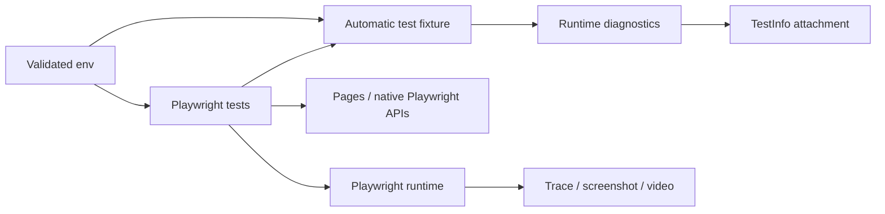

# Architecture

## Design objective

The framework preserves Playwright as the primary browser API. Custom code adds only application concepts and cross-cutting policy: validated runtime configuration, page models, deterministic test data, and privacy-aware failure diagnostics.

Do not build a generic wrapper around `page`, `locator`, `expect`, `request`, or Playwright fixtures. Abstractions should either model application intent or enforce one framework-wide invariant.

## Configuration boundary

`config/env.js` parses process inputs into immutable runtime state.

`TEST_BASE_URL` and `TEST_API_BASE_URL` must:

- be absolute HTTP(S) URLs;
- contain no URL credentials;
- contain no query string or fragment;
- retain optional path prefixes.

Browser engines are allowlisted and timeout budgets must be positive integers. Invalid configuration fails before browser execution.

## Browser and fixture model

Tests import the extended `test`/`expect` surface from `tests/fixtures/test.js`. The extension is intentionally small and retains all native Playwright semantics.

The `runtimeDiagnostics` fixture is automatic. It observes:

- console warnings/errors;
- uncaught page errors;
- failed network requests;
- HTTP 5xx responses.

It does not alter navigation, assertion, retry, or request behavior. The fixture attaches JSON only when actual and expected test status differ.

## Diagnostic privacy and bounds

`src/diagnostics/runtimeDiagnostics.js` centralizes diagnostic sanitization so privacy behavior is testable without a browser.

The helper enforces:

- maximum 100 retained runtime events;
- maximum ~2,000 characters per captured message;
- removal of URL credentials, query strings, and fragments;
- redaction of common bearer/basic credentials;
- redaction of common secret/token/password assignments;
- sanitization of console source-location URLs.

Failed-request and 5xx response URLs are sanitized **before** they enter the event buffer. This is preferable to post-processing a completed artifact because unsafe values never become part of retained diagnostic state.

Structured redaction cannot guarantee that arbitrary application-visible page content is non-sensitive. Test data and screenshots/traces still require safe synthetic inputs.

## Evidence layering

Playwright native evidence remains authoritative for browser reconstruction:

- trace on first retry;
- screenshot on failure;
- retained failure video;
- HTML/JUnit reporting.

The JSON runtime attachment complements those artifacts by explaining console/network conditions around the failure. It is deliberately smaller and easier to scan than a trace.

## Locator and synchronization model

Prefer role, label, accessible name, stable text semantics, or dedicated test IDs. CSS/XPath is reserved for cases without a stable semantic contract.

Playwright auto-waiting and web-first assertions are synchronization primitives. `waitForTimeout()` is prohibited in functional tests. Explicit polling must be bounded and tied to an observable state transition.

## Projects and retries

Browser projects model compatibility variants. Pull-request CI uses Chromium for a fast compatibility signal; Firefox/WebKit can be selected for scheduled/release coverage where risk justifies it.

Retries are capped. A retry-only pass is a reliability signal, not evidence that the original failure was irrelevant. Mutating application operations are not automatically retried by framework wrappers.

## Isolation and parallelism

Browser contexts are isolated per Playwright test. Mutable backend data should also be unique per test/run. Shared authentication state is acceptable only when account/server semantics are safe for concurrent use.

Diagnostic event arrays are test-scoped. No global mutable event buffer is used, so workers cannot contaminate each other's evidence.

## Extension rules

New framework behavior should:

1. preserve native Playwright APIs where they already express intent clearly;
2. validate external input before browser/network side effects;
3. use automatic fixtures only for true cross-cutting policy;
4. bound any retained diagnostic data;
5. sanitize diagnostic URLs/text before persistence;
6. add unit tests for redaction/serialization logic when it can be separated from the browser;
7. avoid hidden retries and fixed waits;
8. keep worker/test state isolated.
