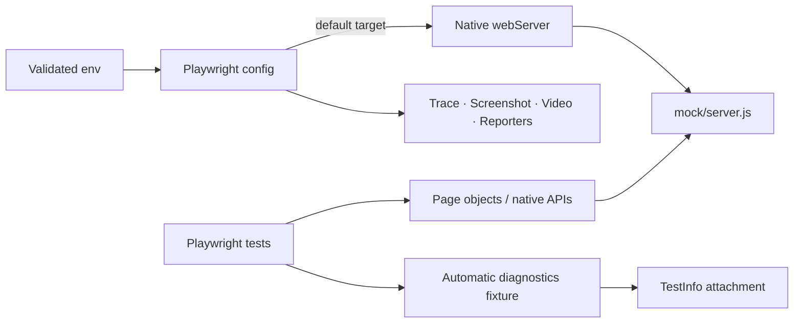

# Architecture

## Design objective

The framework preserves Playwright as the primary browser API while adding only durable policy: validated runtime configuration, deterministic application ownership, feature page models, API/persistence boundaries, test-data isolation, and privacy-aware failure diagnostics.

Do not build a generic wrapper around `page`, `locator`, `expect`, Playwright fixtures, or browser lifecycle. Custom abstractions should model application intent or enforce a framework-wide invariant.

## Configuration boundary

`config/env.js` parses process inputs into immutable runtime state. Browser/API URLs must be absolute HTTP(S), include a hostname, and contain no URL credentials, query string, or fragment. Browser engines are allowlisted and timeout budgets must be positive.

The deterministic defaults are:

- `TEST_BASE_URL=http://127.0.0.1:3001`;
- `TEST_API_BASE_URL=http://127.0.0.1:3001`.

A non-default URL explicitly selects a deployed target.

## Deterministic target lifecycle

`mock/server.js` is a repository-owned Node HTTP fixture. It serves browser pages, `/health`, and the deterministic `/posts` API contract.

`playwright.config.js` compares the configured browser target with `DEFAULT_FIXTURE_URL`. When they match, Playwright's native `webServer` capability:

1. starts `node mock/server.js`;
2. waits for `/health`;
3. owns the server for the browser run;
4. reuses a developer-started fixture locally when appropriate;
5. stops owning a local process when a non-default target is selected.

This keeps the required browser gate independent of public DNS/TLS/service availability while preserving an explicit environment-integration path.

The Jest API suite can import the same server and bind it on an ephemeral loopback port. Browser and API tests therefore share fixture behavior without sharing a fixed process lifecycle.

## Browser and fixture model

Browser specs import the extended `test`/`expect` surface from `tests/fixtures/test.js`. The extension remains intentionally small and retains native Playwright semantics.

The automatic runtime diagnostic fixture observes console warnings/errors, page errors, failed requests, and HTTP 5xx responses. It does not alter navigation, actionability, assertions, retries, or requests.

## Diagnostic privacy and bounds

`src/diagnostics/runtimeDiagnostics.js` sanitizes evidence before persistence. It bounds event count/message size, removes URL credentials/query/fragment, redacts common bearer/basic credentials and secret-like assignments, and sanitizes console locations.

Trace, screenshot, video, and page-visible data are not generically redacted. Synthetic/controlled test data remains necessary.

## Evidence layering

Native Playwright evidence is authoritative:

- assertion and stack;
- trace on first retry;
- screenshot on failure;
- retained failure video;
- HTML/JUnit reports.

The compact JSON runtime attachment complements those artifacts with bounded console/network/page-error context and run/project/retry identity.

## Locator and synchronization model

Prefer accessible semantics and stable application-owned test IDs. CSS/XPath is reserved for cases without a stronger contract.

Playwright auto-waiting and web-first assertions are the synchronization primitives. Functional tests must not use `waitForTimeout()` as readiness. Any explicit polling must be bounded and tied to an observable state.

## Projects and retries

Chromium is the primary compatibility signal; Firefox and WebKit are independent extended projects. Retries are capped. A retry-only pass remains a reliability defect signal.

Mutating application behavior is not automatically retried by framework wrappers.

## Isolation and parallelism

Playwright creates isolated browser contexts per test. Mutable backend data must also have unique ownership. Diagnostic event buffers are test-scoped, so workers do not contaminate one another.

The local fixture is intentionally stateless for browser flows. New stateful fixture behavior must define isolation/reset semantics before parallel use.

## API and persistence boundaries

`PostsApiClient` owns native-fetch timeout/correlation/status/shape policy and supports an injected fetch implementation for deterministic transport tests. SQLite repository behavior remains a separate data-layer concern with explicit lifecycle.

Browser tests should not be promoted into API/data verification when a lower deterministic layer already proves the requirement.

## CI boundary

Primary CI executes Jest on the supported Node matrix, validates Playwright discovery, then runs Chromium against the repository fixture. Extended CI runs Chromium, Firefox, and WebKit against the same local target.

Workflows use least-privilege permissions, concurrency cancellation, bounded runtime, run correlation, and retained evidence.

A deployed-target failure and a local-fixture framework failure are distinct failure domains and should remain distinguishable.

## Extension rules

New framework behavior should:

1. preserve native Playwright APIs where they already express intent;
2. validate configuration before browser/network side effects;
3. keep required CI targets deterministic and repository-owned;
4. use Playwright native `webServer` rather than ad-hoc process management for the default browser target;
5. keep application abstractions feature-oriented;
6. bound and sanitize retained diagnostics before persistence;
7. avoid fixed waits and hidden retries;
8. keep worker/test/application state isolated;
9. classify deployed-environment integration separately from required framework CI;
10. add fast contract tests when lifecycle/config/privacy logic can be tested without a browser.
